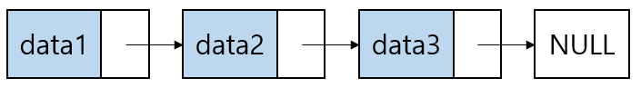
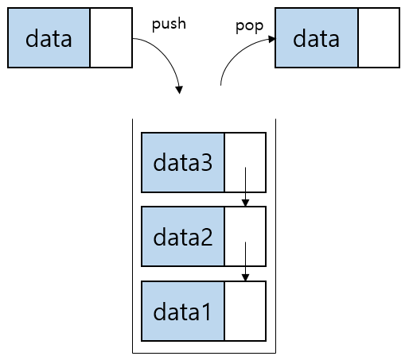
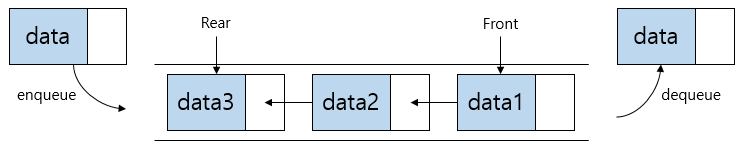
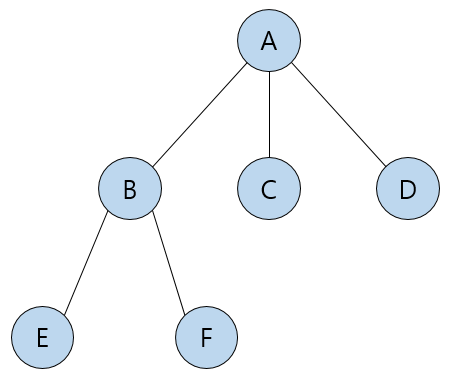
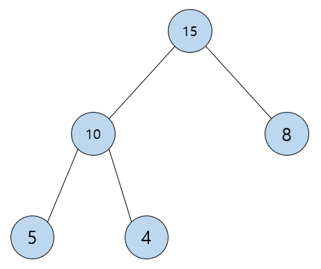
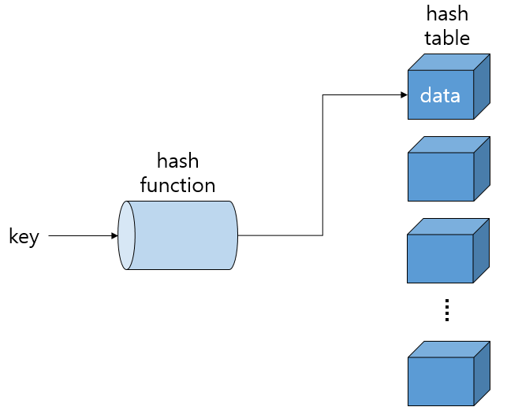
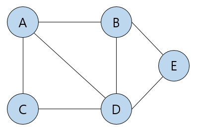

# Data Structure

## 연결리스트(Linked List)



- 노드(Node): 데이터를 저장하는 단위로 데이터와 포인터로 구성
- 포인터(Pointer): 각각의 노드 안에서 다음 노드의 주소를 가리킴
- 연결리스트는 여러 개의 노드들이 연결된 구조

### 연결리스트 ADT

- head: 연결리스트의 맨 앞을 가리킨다
- 메소드
  - append(data): 연결리스트의 맨 뒤에 노드를 추가한다
  - delete(): 연결리스트의 맨 뒤의 노드를 삭제 및 반환한다
  - size(): 연결리스트의 저장된 노드의 총 개수를 반환한다
  - show(): 연결리스트에 저장된 데이터들을 반환한다

```python
class Node:
    def __init__(self, data):
        self.data = data
        self.next = None

class LinkedList:
    def __init__(self):
        self.head = None

    def append(self, data):
        newNode = Node(data)

        if self.head is None:
            self.head = newNode

        else:
            current = self.head
            while current.next is not None:
                current = current.next
            current.next = newNode

    def delete(self):
        if self.head is None:
            return 'empty'

        else:
            current = self.head
            previous = current
            while current.next is not None:
                previous = current
                current = current.next
            previous.next = None
            return current.data

    def size(self):
        if self.head is None:
            return 0
        else:
            current = self.head
            count = 1
            while current.next is not None:
                current = current.next
                count += 1
            return count

    def show(self):
        if self.head is None:
            return 'empty'
        else:
            string = ''
            current = self.head
            while current.next is not None:
                string += str(current.data) + '->'
                current = current.next
            string += str(current.data)
            return string
```

## 스택(Stack)



- LIFO(Last In First Out, 후입선출)
- 스택은 한쪽이 막힌 상자로, 먼저 들어간 것이 나중에 나오는 구조

### 스택 ADT

- top: 스택의 맨 위, 가장 나중에 들어온 노드를 가리킨다
- 메소드
  - push(data): 스택의 맨 위에 노드를 추가한다
  - pop(): 스택 맨 위의 노드를 삭제 및 반환한다
  - peek(): 스택 맨 위 노드의 데이터 값을 반환한다
  - size(): 스택의 크기를 반환한다
  - show(): 스택에 저장된 노드들을 반환한다

```python
class Node:
    def __init__(self, data):
        self.data = data
        self.next = None

class Stack:
    def __init__(self):
        self.top = None

    def push(self, data):
        newNode = Node(data)
        newNode.next = self.top
        self.top = newNode

    def pop(self):
        if self.top is None:
            return 'empty'
        else:
            popNode = self.top
            self.top = self.top.next
            return popNode.data

    def peek(self):
        if self.top is None:
            return 'empty'
        else:
            return self.top.data

    def size(self):
        if self.top is None:
            return 0
        else:
            current = self.top
            count = 1
            while current.next is not None:
                current = current.next
                count += 1
            return count

    def show(self):
        if self.top is None:
            return 'empty'
        else:
            string = '->'
            current = self.top
            while current.next is not None:
                string += str(current.data) + '->'
                current = current.next
            string += str(current.data)
            return string
```

## 큐(Queue)



- FIFO(First In First Out, 선입선출)
- 큐는 양쪽이 뚫린 터널로, 먼저 들어간 것이 먼저 나오는 구조

### 큐 ADT

- front: 큐의 맨 앞, 가장 먼저 들어온 노드를 가리킨다
- rear: 큐의 맨 뒤, 가장 나중에 들어온 노드를 가리킨다
- 메소드
  - enqueue(data): 큐에 가장 나중에 들어온 노드 앞에 노드를 추가한다
  - dequeue(): 큐에 가장 먼저 들어온 노드를 삭제 및 반환한다
  - peek(): 큐에 가장 먼저 들어온 노드의 데이터를 반환한다
  - size(): 큐의 크기를 반환한다
  - show(): 큐에 저장된 노드들을 반환한다

```python
class Node:
    def __init__(self, data):
        self.data = data
        self.next = None

class Queue:
    def __init__(self):
        self.front = None
        self.rear = None

    def enqueue(self, data):
        newNode = Node(data)
        if self.front is None:
            self.front = newNode
            self.rear = newNode
        else:
            self.rear.next = newNode
            self.rear = newNode

    def dequeue(self):
        if self.front is None:
            return 'empty'
        else:
            dequeueNode = self.front
            self.front = self.front.next
            return dequeueNode.data

    def peek(self):
        if self.front is None:
            return 'empty'
        else:
            return self.front.data

    def size(self):
        if self.front is None:
            return 0
        else:
            current = self.front
            count = 1
            while current is not self.rear:
                current = current.next
                count += 1
            return count

    def show(self):
        if self.front is None:
            return 'empty'
        else:
            current = self.front
            string = ''
            while current.next is not None:
                string += str(current.data) + '->'
                current = current.next
            string += str(current.data) + '->'
            return string
```

## 트리(Tree)

- 트리는 계층적 관계를 표현하는 비선형 자료구조



- 용어
  - 노드(node): 트리의 구성요소에 해당하는 A, B, C, D, E, F와 같은 요소
  - 간선(edge): 노드와 노드를 연결하는 연결선
  - 루트 노드(root node): A와 같은 최상위 노드
  - 단말 노드(terminal node): 자식 노드가 없는 E, F, C, D와 같은 노드
  - 내부 노드(internal node): 단말 노드르를 제외한 A, B와 같은 노드
  - 차수(degree): 특정 노드의 자식 노드의 수
  - 높이(height): 루트 노드에서 단말 노드까지의 깊이
  - 레벨(level): 각 층의 번호

### 이진 탐색 트리(Binary Search Tree) ADT

- 이진 탐색 트리는 좌측엔 부모 노드보다 작은 값, 우측엔 부모 노드보다 큰 값을 갖는 트리이다
- root: 트리의 최상위 노드를 가리킨다
- 메소드
  - insert(data): 트리에 노드를 추가한다
  - delete(data), delete_node(node, data): 재귀를 이용하여 트리에 data 값을 가진 노드를 삭제한다
  - show(node): 트리에 저장된 노드들을 inorder 방식으로 출력한다

```python
class Node:
    def __init__(self, data):
        self.data = data
        self.left = None
        self.right = None


class BST:
    def __init__(self):
        self.root = None

    def insert(self, data):
        newNode = Node(data)

        if self.root is None:
            self.root = newNode
        else:
            current = self.root
            while True:
                if data > current.data:
                    if current.right is None:
                        current.right = newNode
                        break
                    else:
                        current = current.right
                else:
                    if current.left is None:
                        current.left = newNode
                        break
                    else:
                        current = current.left

    def delete(self, data):
        self.root = self.delete_node(self.root, data)

    def delete_node(self, node, data):
        if node is None:
            return None

        if data == node.data:
            if node.left is None and node.right is None:
                return None
            elif node.left is None:
                return node.right
            elif node.right is None:
                return node.left
            else:
                current = node
                while current.left is not None:
                    current = current.left
                node.data = current.data
                node.left = None
                node.right = self.delete_node(node.right, current.data)
                return node
        elif data < node.data:
            node.left = self.delete_node(node.left, data)
            return node
        else:
            node.right = self.delete_node(node.right, data)
            return node

    def show(self, node):
        if node is not None:
            self.show(node.left)
            print(node.data, end=" ")
            self.show(node.right)
```

## 힙(Heap)



- 힙은 완전 이진 트리로 모든 노드에 저장된 값이 자식 노드보다 크거나 같은(혹은 작거나 같은) 구조
- 이진 탐색 트리는 탐색을 위한 구조라면 힙은 최대/최소 값 검색을 위한 구조

### 최대 힙(max heap) ADT

- arr: 데이터를 저장할 리스트
  - index에 대해 왼쪽 자식은 (index X 2 + 1), 오른쪽 자식은 (index X 2 + 2)
- 메소드:
  - swap(index, parentIndex): 자식과 부모의 위치를 바꾼다
  - parent(index): 해당 index의 부모 인덱스를 반환한다
  - left_child(index): 해당 index의 왼쪽 자식 인덱스를 반환한다
  - right_child(index): 해당 index의 오른쪽 자식 인덱스를 반환한다
  - insert(data): 힙에 data를 추가한다
  - delete(): 힙에 가장 큰 값을 삭제 및 반환하고 재정렬한다
  - maxHeapify(index): 해당 index를 기준으로 재정렬한다
  - show(): 힙에 저장된 데이터를 출력한다

```python
class MaxHeap:
    def __init__(self):
        self.arr = []

    def swap(self, index, parentIndex):
        self.arr[index], self.arr[parentIndex] = self.arr[parentIndex], self.arr[index]

    def parent(self, index):
        return (index - 1) // 2

    def left_child(self, index):
        return index * 2 + 1

    def right_child(self, index):
        return index * 2 + 2

    def insert(self, data):
        self.arr.append(data)
        index = len(self.arr) - 1
        while 0 <= index:
            parent_index = self.parent(index)
            if parent_index >= 0 and self.arr[parent_index] < self.arr[index]:
                self.swap(index, parent_index)
                index = parent_index
            else:
                break

    def delete(self):
        index = len(self.arr) - 1
        if index < 0:
            return 'empty'
        self.swap(0, index)
        data = self.arr.pop()
        self.maxHeapify(0)
        return data

    def maxHeapify(self, index):
        left = self.left_child(index)
        right = self.right_child(index)
        maxIndex = index

        if left <= len(self.arr) - 1 and self.arr[maxIndex] < self.arr[left]:
            maxIndex = left
        if right <= len(self.arr) - 1 and self.arr[maxIndex] < self.arr[right]:
            maxIndex = right

        if maxIndex != index:
            self.swap(index, maxIndex)
            self.maxHeapify(maxIndex)

    def show(self):
        string = ''
        for num in self.arr:
            string += str(num) + ' '
        print(string)
```

## 우선순위 큐(priority Queue)

- 우선순위에 따라 데이터를 처리하는 자료구조
- 보통 힙을 이용하여 구현한다

### 우선순위 큐 ADT

- queue: 데이터를 저장할 리스트
- 메소드:
  - enqueue(rank, data): rank(우선순위)와 데이터를 삽입한다
  - dequeue(): 우선순위에 따라 데이터를 반환한다
  - show(): queue에 저장된 데이터를 출력한다

```python
from heapq import heappush, heappop

class PriorityQueue:
    def __init__(self):
        self.queue = []

    def enqueue(self, rank, data):
        heappush(self.queue, (rank, data))

    def dequeue(self):
        if not self.queue:
            return 'empty'
        return heappop(self.queue)

    def show(self):
        print(self.queue)
```

## 해쉬 테이블(Hash Table)



- 키에 데이터를 저장하는 자료구조
- 용어
  - 해쉬(Hash): 임의 값을 고정 길이로 변환하는 것
  - 해쉬 테이블(Hash Table): 키 값의 연산에 의해 직접 접근이 가능한 데이터 구조
  - 해싱 함수(Hashing Function): 키에 대해 산술 연산을 이용해 데이터 위치를 찾을 수 있는 함수

### 해쉬 테이블 ADT

- table: 데이터를 저장할 리스트
- 메소드:
  - hash_funtion(key): 간단하게 key 값을 아스키코드로 변환한다
  - put(key, data): key 값에 data를 저장한다
  - find(key): 해당 key 값의 data를 반환한다

```python
class HashTable:
    def __init__(self):
        self.table = [None for i in range(139)]

    def hash_function(self, key):
        return ord(key)

    def put(self, key, data):
        self.table[self.hash_function(key)] = data

    def find(self, key):
        return self.table[self.hash_function(key)]
```

## 그래프(Graph)



- 그래프는 정점(Vertex)과 간선(Edge)로 구성된 자료구조

### 그래프 탐색

- 그래프 탐색은 하나의 정점에서 시작하여 모든 정점을 한 번씩 방문하는 것
- 그래프에서 탐색은 어떤 노드에 방문했는지의 여부를 반드시 검사해야 한다
- 깊이 우선 탐색(Depth First Search)
  - 루트 노드(혹은 다른 임의의 노드)에서 시작해서 다음 분기(branch)로 넘어가기 전에 해당 분기를 완벽하게 탐색하는 방법
- 너비 우선 탐색(Breadth First Search)
  - 루트 노드(혹은 다른 임의의 노드)에서 시작해서 인접한 노드를 먼저 탐색하는 방법

### 그래프 ADT

- graph: 한 노드에서 다른 노드로 갈 수 있는 경로를 저장하며, 딕셔너리와 집합 자료형으로 구현
- 메소드:
  - addEdge(v, w): v와 w를 연결하는 간선을 그래프에 추가한다
  - show(): 각 정점별 간선 정보를 출력한다
  - dfs(start): start부터 dfs 방식으로 모든 노드를 탐색하여 출력한다
  - bfs(start): start부터 bfs 방식으로 모든 노드를 탐색하여 출력한다

```python
class Graph:
    def __init__(self):
        self.graph = {}

    def addEdge(self, v, w):
        if v not in self.graph:
            self.graph[v] = {w}
        else:
            self.graph[v].add(w)
            set(self.graph[v])

        if w not in self.graph:
            self.graph[w] = {v}
        else:
            self.graph[w].add(v)
            set(self.graph[w])

    def show(self):
        for i in self.graph:
            print(i, '->', self.graph[i])

    def dfs(self, start):
        stack = [start]
        marked = [start]
        while stack:
            v = stack.pop()
            print(v, end = ' ')
            for w in self.graph[v]:
                if w not in marked:
                    stack.append(w)
                    marked.append(w)
        print()

    def bfs(self, start):
        queue = [start]
        marked = [start]
        while queue:
            v = queue.pop(0)
            print(v, end = ' ')
            for w in self.graph[v]:
                if w not in marked:
                    queue.append(w)
                    marked.append(w)
        print()
```
