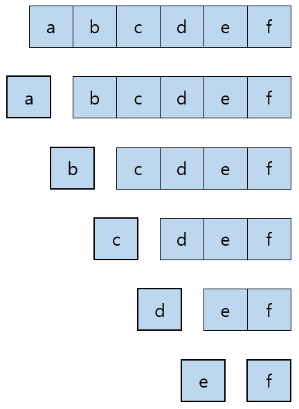
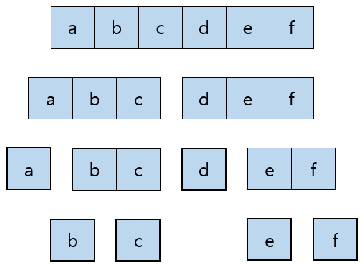

# 알고리즘

## Brute Force

- 컴퓨터의 빠른 계산 능력을 이용해 가능한 경우의 수를 일일이 나열하면서 답을 찾는 방법



### 재귀 호출

- 컴퓨터가 수행하는 많은 작업들은 대개 작은 조각들로 나누어 볼 수 있다
- 들여다보는 범위가 작아질수록 각 조각의 형태가 유사해지는 작업을 많이 볼 수 있다
- 이런 작업에 재귀 호출이 유용하게 사용된다
- 재귀 함수는 자기 자신을 호출하는 함수로, brute force에서는 자신이 수행할 작업을 유사한 형태의 여러 조각으로 쪼갠 뒤 그 중 한 조각을 수행하고, 나머지 조각을 다시 호출하여 사용한다.
- 이때 쪼개지지 않는 가장 작은 작업들을 가리켜 기저 사례(base case)라고 하며, 모든 입력이 기저 사례의 답을 이용해 계산되어야 한다

### 예제) 모든 조합 구하기

```python
"""
배열 arr에서 k개의 원소를 고르는 모든 경우의 수
한 원소를 뽑고, 그 원소를 제외한 배열의 조합을 구한다
comb([1, 2, 3, 4], 2) = ([1] + comb([2, 3, 4], 1)) and
                        ([2] + comb([1, 3, 4], 1)) and
                        ([3] + comb([1, 2, 4], 1)) and
                        ([4] + comb([1, 2, 3], 1))
"""
def comb1(arr, k):
    answer = []
    if k > len(arr):
        return answer

    if k == 1:
        for i in arr:
            answer.append([i])
    else:
        for i in range(len(arr) - k + 1):
            for temp in comb1(arr[i + 1:], k - 1):
                answer.append([arr[i]] + temp)
    return answer

"""
yield는 함수가 제너레이터를 반환한다는 것을 제외하고 return과 비슷하게 사용되는 키워드
제너레이터는 함수가 실행됐는데 더 이상 yield를 만나지 못했을 때 다 끝난 것으로 간주
"""
def comb2(arr, k):
    for i in range(len(arr)):
        if k == 1:
            yield arr[i]
        else:
            for j in comb2(arr[i + 1:len(arr)], k - 1):
                yield arr[i] + j
```

## Divide & Conquer

- 주어진 문제를 둘 이상의 부분 문제로 나눈 뒤, 각 문제에 대한 답을 재귀 호출을 통해 계산하고, 각 부분 문제의 답으로부터 전체 문제의 답을 계산하는 방법



### 분할 정복 알고리즘 구성요소

1. 문제를 더 작은 문제로 분할하는 과정(divide)
2. 각 문제에 대해 구한 답을 원래 문제에 대한 답으로 병합하는 과정(merge)
3. 더이상 답을 분할하지 않고 곧장 풀 수 있는 매우 작은 문제(base case)

```python
"""
출처: 알고스팟(https://www.algospot.com/judge/problem/read/QUADTREE)
문제:
쿼드 트리는 2N × 2N 크기의 흑백 그림을 다음과 같은 과정을 거쳐 문자열로 압축합니다.
1. 이 그림의 모든 픽셀이 검은 색일 경우 이 그림의 쿼드 트리 압축 결과는 그림의 크기에 관계없이 b가 됩니다.
2. 이 그림의 모든 픽셀이 흰 색일 경우 이 그림의 쿼드 트리 압축 결과는 그림의 크기에 관계없이 w가 됩니다.
3. 모든 픽셀이 같은 색이 아니라면, 쿼드 트리는 이 그림을 가로 세로로 각각 2등분해 4개의 조각으로 쪼갠 뒤 각각을 쿼드 트리 압축합니다. 이때 전체 그림의 압축 결과는 x(왼쪽 위 부분의 압축 결과)(오른쪽 위 부분의 압축 결과)(왼쪽 아래 부분의 압축 결과)(오른쪽 아래 부분의 압축 결과)가 됩니다.

쿼드트리로 압축된 흑백그림이 주어졌을 때, 이 그림을 상하로 뒤집은 그림을 쿼드 트리 압축해서 출력하는 프로그램을 작성하세요.

상하좌우 4개로 분할하여 재귀 호출한 뒤, 위치를 바꾸어 합병한다.
"""

# iter() 함수는 전달된 데이터의 반복자를 꺼내 반환한다
def solution(tree):
    return reverse(iter(tree))

# next() 함수는 반복자를 입력받아 그 반복자가 다음에 출력해야 할 요소를 반환한다
def reverse(it):
    current = next(it)
    if current == 'w' or current == 'b':
        return current

    upperLeft = reverse(it)
    upperRight = reverse(it)
    lowerLeft = reverse(it)
    lowerRight = reverse(it)

    return 'x' + lowerLeft + lowerRight + upperLeft + upperRight
```
