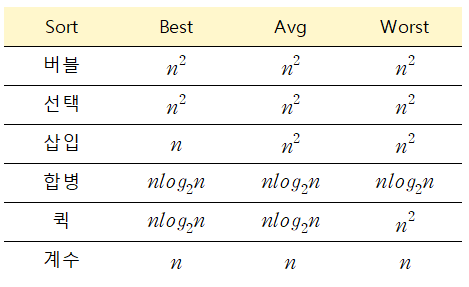
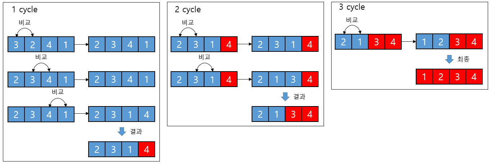
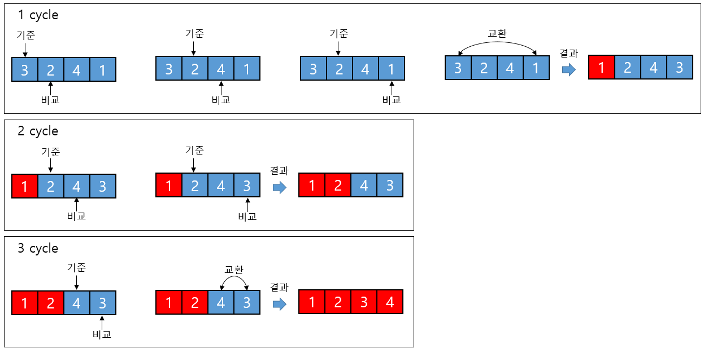
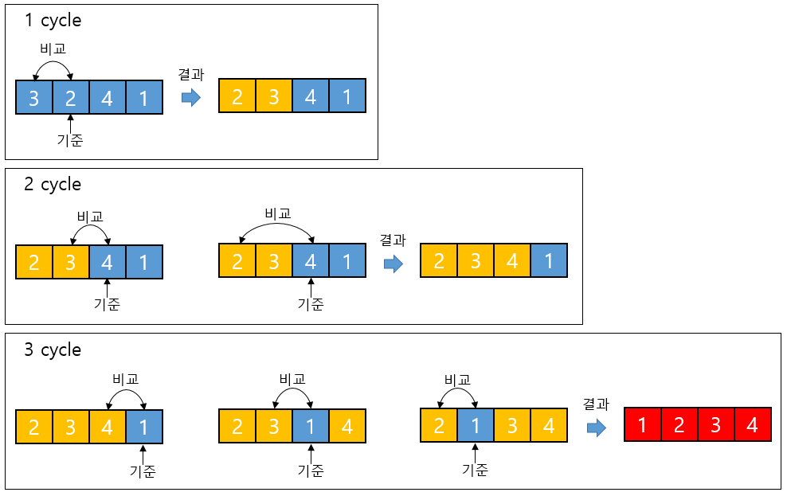
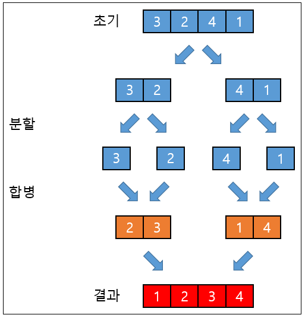
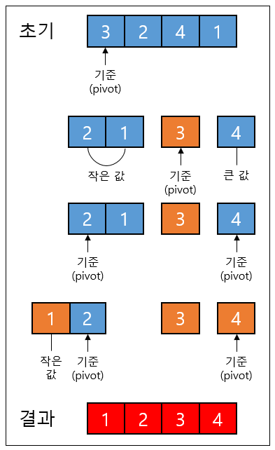
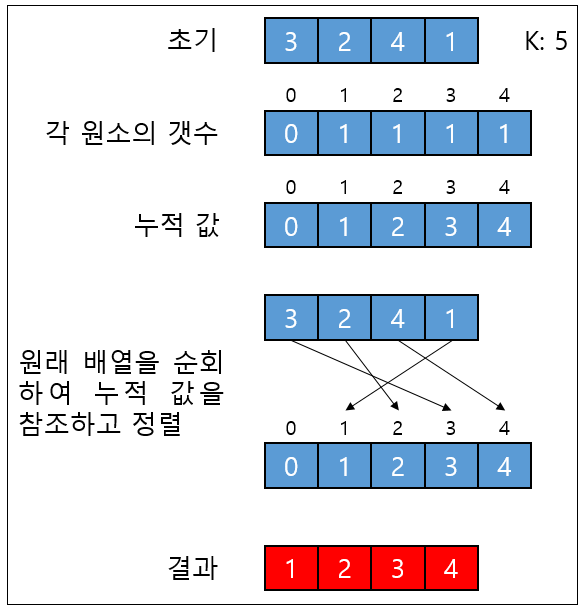

# Sort

## 성능 비교

## 버블 정렬(Bubble Sort)

- 서로 인접한 두 원소를 비교하여 정렬하는 알고리즘
- 매 사이클마다 가장 큰 값을 맨 뒤로 보낸다.

## 선택 정렬(Selection Sort)

- 해당 순서에 원소를 넣을 위치는 정해져 있고, 어떤 원소를 넣을지 선택하는 알고리즘
- 매 사이클마다 가장 작은 값을 맨 앞으로 보낸다.

## 삽입 정렬(Insertion Sort)

- 앞에서부터 이미 정렬된 배열과 비교하여 자신의 위치를 찾아 삽입하는 알고리즘
- 매 사이클마다 부분 정렬한다.

## 합병 정렬(Merge Sort)

- 배열을 쪼개 합병하면서 정렬하는 분할 정복 알고리즘
- 합병하는 단계에서 정렬이 이루어진다.

## 퀵 정렬(Quick Sort)

- 어느 한 원소(pivot)를 기준으로 작은 값, 큰 값으로 나누어 졍렬하는 분할 정복 알고리즘

## 계수 정렬(Counting Sort)

- 배열이 1 부터 K까지의 원소를 가질 때, 각 원소들 아래에 몇 개의 원소들이 존재하는 지를 계산하는 알고리즘
- 예를 들어 5보다 작은 정수(1, 2, 3, 4)가 10개 있다면 5의 위치는 11번째이다.

